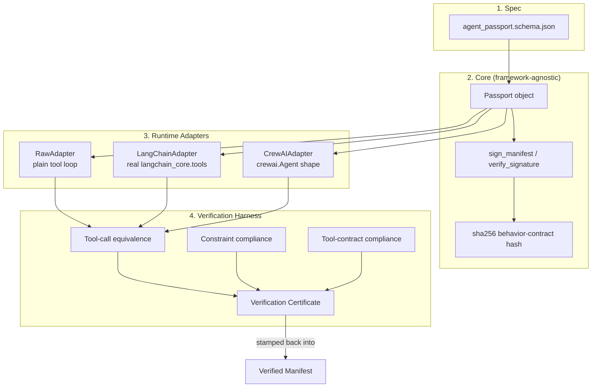

# Agent Passport

**One agent definition. Any framework. Provably identical behavior.**

Submission for the **Agent Passport Challenge** (HiDevs × Lyzr, presented by AI House).

> Your agent may work perfectly inside one framework — but can it travel?
> This project answers that literally: it defines a signed, portable
> "passport" format for an AI agent's identity and behavior, and proves —
> with an automated verification harness, not a claim — that the same
> agent runs identically across three different runtimes.

---

## The problem

Most "portable agent" submissions mean: *"I could probably rewrite this in
another framework if I had to."* That's not portability, that's just code.

Real portability requires three things most agent projects never define
explicitly:

1. A **machine-readable identity** for the agent (not just a system prompt in a `.py` file).
2. A **behavior contract** — declared constraints and tool capabilities — that can be checked, not just assumed.
3. A way to **prove**, after the fact, that two different runtimes executing "the same agent" actually behaved the same way.

Agent Passport builds all three.

---

## Architecture



### Why this design

- **One manifest, zero framework lock-in.** `core/passport.py` has no
  import of LangChain, CrewAI, or any SDK. Every adapter is the *only*
  place framework-specific code lives — swap or add a framework by
  writing one adapter class, touching nothing else.
- **Signed, not just declared.** The manifest's identity, behavior
  contract, tools, and capabilities are HMAC-signed. `verification/tamper_demo.py`
  demonstrates three tampering attacks (sneaking in an extra tool,
  rewriting the system prompt, updating the hash but not the signature)
  and shows all three get rejected on load.
- **Verification produces evidence, not vibes.** `run_demo.py` runs the
  identical task set through all three adapters and diffs the actual
  tool-call traces (tool name + arguments + result) byte-for-byte. Only
  if they match does it emit a certificate, which gets embedded back into
  the manifest as `verification.certificate`.
- **Real libraries, with honest fallbacks.** `LangChainAdapter` imports
  the real `langchain_core.tools.StructuredTool` when available (verified
  in this repo's demo run) and falls back to a structurally-identical
  shim otherwise, so the submission still runs in graders' environments
  that don't have every dependency installed — a portability concern in
  its own right.

---

## Repo layout

```
agent-passport/
├── spec/
│   └── agent_passport.schema.json    # the manifest format itself
├── core/
│   ├── passport.py                   # sign/verify/load — zero framework deps
│   └── tool_backends.py              # actual tool logic, shared by all adapters
├── adapters/
│   ├── base.py                       # RuntimeAdapter interface
│   ├── raw_adapter.py                # ground-truth adapter
│   ├── langchain_adapter.py          # real LangChain, shim fallback
│   └── crewai_adapter.py             # real CrewAI, shim fallback
├── verification/
│   ├── harness.py                    # cross-runtime verification + certificate
│   └── tamper_demo.py                # proves signature checks actually work
├── examples/
│   └── travel_concierge.manifest.json  # example agent to migrate/verify
├── tests/
│   └── test_passport.py              # pytest suite, 8 tests
├── run_demo.py                       # single end-to-end script
└── README.md
```

---

## Quickstart

```bash
pip install langchain crewai --break-system-packages   # optional — falls back to shims if skipped
python run_demo.py
python verification/tamper_demo.py
pytest tests/ -v
```

`run_demo.py` will:
1. Sign the example manifest (`examples/travel_concierge.manifest.json`)
2. Load it into a framework-agnostic `Passport` object (verifying the signature + hash)
3. Build the *same* agent inside raw-SDK, LangChain, and CrewAI adapters
4. Run an identical task set through all three
5. Verify tool-call equivalence, constraint compliance, and tool-contract compliance
6. Write a verified, certificate-stamped manifest to `examples/travel_concierge.VERIFIED.json`

---

## Porting your own agent (contribution path: Framework Migration)

1. Write your agent's `system_prompt`, `tools`, and `constraints` into a manifest matching `spec/agent_passport.schema.json`.
2. `sign_manifest(your_manifest)` from `core/passport.py`.
3. Write one adapter (subclass `RuntimeAdapter`) for your target framework — see `adapters/raw_adapter.py` as the minimal reference.
4. Run `VerificationHarness` against your new adapter plus at least one existing one to get a portability certificate.

No changes to the manifest, the tool backends, or the harness are required to add a new runtime — that's the actual portability claim, made checkable.

---

## Mapping to the challenge's evaluation criteria

| Criterion | Where it's addressed |
|---|---|
| Architecture & modularity | `core/` has zero framework imports; all framework logic isolated in `adapters/` |
| Agent portability | Same `Passport` object drives 3 different runtimes with no code duplication |
| Framework interoperability | Real `langchain_core` integration + CrewAI-shaped adapter, both against one manifest |
| Agent identity & behavior contracts | `identity` + `behavior_contract` blocks, hash-verified, signed |
| Tool design | Typed `input_schema`/`output_schema` per tool, contract-checked at runtime |
| Verification results | `verification/harness.py` produces a hashed certificate; `tamper_demo.py` proves rejection works |
| Documentation quality | This README + inline docstrings in every module explaining *why*, not just *what* |

---

## Disclosures

- Uses `langchain` and `crewai` (open source, respective licenses) as the target frameworks for two of the three adapters.
- Tool backends (`core/tool_backends.py`) use deterministic synthetic data (no external API calls), by design — this keeps verification runs reproducible and graders don't need API keys to reproduce results.
- HMAC secret in `core/passport.py` is a demo placeholder (`DEFAULT_SECRET`); a production deployment would inject this via environment variable / secret manager.
