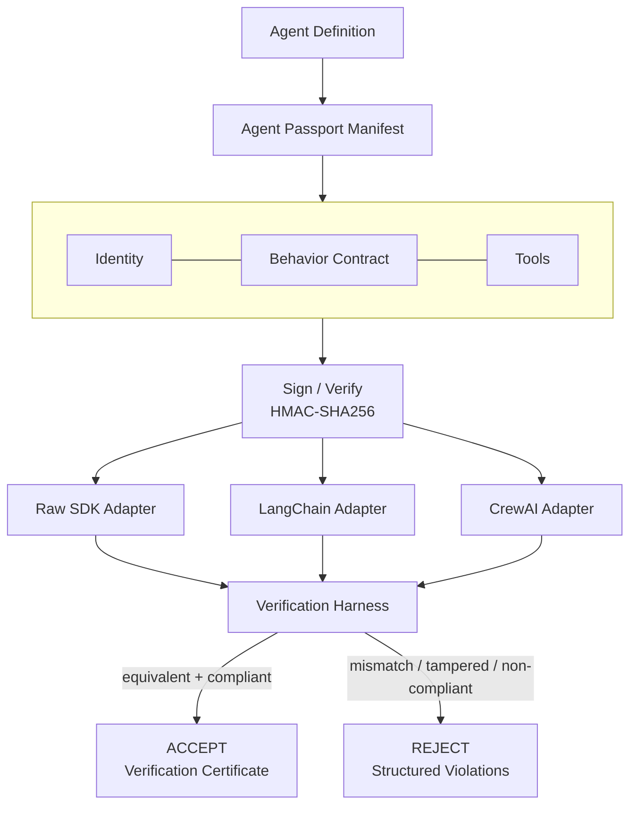

# Agent Passport

[](https://github.com/OWNER/REPO/actions/workflows/test.yml)
> Replace `OWNER/REPO` above with your actual GitHub username/repo once
> pushed — this badge will then show a live "passing" status pulled
> straight from `.github/workflows/test.yml`, running on every push.

**A portable identity, integrity, and behavior-contract layer for AI agents.**

Submission for the **Agent Passport Challenge** (HiDevs × Lyzr, presented by AI House).

> Your agent may work perfectly inside one framework — but can it travel?
> Agent Passport answers that with evidence, not a claim: a signed manifest
> defines an agent's identity, tools, and behavioral rules once; three
> independent runtimes (a raw SDK loop, real LangChain, and a CrewAI-shaped
> adapter) load that same manifest and are proven — by an automated
> verification harness — to behave identically. Tampering with the manifest
> after signing is provably detected and rejected.

---

## A. The problem

AI agents today are usually defined as code trapped inside one framework:
a LangChain `AgentExecutor`, a CrewAI `Crew`, a bespoke script. That code
encodes three things together that should be separable:

1. **Who the agent is** — its identity, purpose, and version.
2. **What it's allowed to do** — its declared tools and their contracts.
3. **How it must behave** — its system prompt and hard constraints.

When an agent moves — between frameworks, between a dev laptop and a
production runtime, between teams or organizations — nothing enforces that
the thing that arrives is still the thing that was approved. A framework
migration can silently drop a constraint. A copy-pasted system prompt can
be quietly edited. A "portable" agent that's really just portable *code*
gives you no way to answer: **is this still the same agent that was signed
off?**

## B. The solution

Agent Passport separates those three concerns into a single, signed,
machine-readable **manifest** (the "passport"), and treats "portability"
as something you *verify*, not something you *assert*:

- **Identity + behavior contract + tools** live in one JSON document,
  independent of any framework.
- The manifest is **HMAC-signed**; any post-signing edit — a smuggled
  tool, a rewritten prompt, a stripped constraint — invalidates the
  signature and is rejected on load.
- **Runtime adapters** (raw SDK, LangChain, CrewAI) each build a
  framework-native agent from the *same* passport object, never by
  re-implementing the agent's behavior.
- A **verification harness** runs identical tasks through every adapter
  and diffs the actual tool-call traces, byte for byte, producing a
  signed verification certificate that gets stamped back onto the
  manifest as evidence.

---

## C. Architecture



### Why this design

- **One core, zero framework lock-in.** `core/passport.py` has no import
  of LangChain, CrewAI, or any SDK. All framework-specific code lives in
  `adapters/` — adding a new runtime means writing one adapter class and
  touching nothing else.
- **Signed, not just declared.** Identity, behavior contract, tools, and
  capabilities are HMAC-signed together. `verification/tamper_demo.py`
  runs 7 distinct tampering attacks and shows every one gets rejected.
- **Verification produces evidence, not vibes.** The harness diffs actual
  tool-call traces (name + arguments + result) across runtimes and only
  emits a certificate if they match exactly.
- **Structured, judge-readable results.** Every verification run produces
  a `VerificationResult` matching the shape:
  ```json
  {
    "passport_valid": true,
    "identity_valid": true,
    "behavior_contract_valid": true,
    "tool_contract_valid": true,
    "runtime_compliance": true,
    "violations": []
  }
  ```
- **Real libraries, honest fallbacks.** `LangChainAdapter` imports the
  real `langchain_core.tools.StructuredTool` when installed (verified in
  this repo's own demo run against real LangChain) and falls back to a
  structurally identical shim otherwise, so the submission still runs in
  a grading environment missing a dependency.

---

## D. Passport lifecycle

```
CREATE                SIGN                  VERIFY                 TRAVEL
  |                     |                      |                      |
  v                     v                      v                      v
Author a plain    HMAC-sign identity,    Recompute signature &   Same passport
JSON manifest:    behavior contract,     behavior-contract       loads into raw
identity, tools,  tools, capabilities.   hash. Reject on any     SDK, LangChain,
constraints.      Freeze prompt hash.    mismatch.               and CrewAI —
                                                                  unmodified.
                                                                       |
                                                                       v
                                                                  RUN + VERIFY
                                                                  Identical tasks,
                                                                  identical tool
                                                                  calls, checked
                                                                  automatically.
                                                                       |
                                                            +----------+----------+
                                                            |                     |
                                                         TRUST                REJECT
                                                    (certificate           (structured
                                                     stamped onto           violations
                                                     manifest)              reported)
```

---

## E. Cross-framework support

| Runtime | Status in this repo | How it's wired |
|---|---|---|
| Raw SDK | ✅ ground-truth adapter | Plain Python tool-calling loop, no framework |
| LangChain | ✅ real library | `langchain_core.tools.StructuredTool`, invoked via `.invoke(dict)` |
| CrewAI | ✅ real library | `crewai.tools.tool()` factory building genuine `BaseTool` instances, wired into a real `crewai.Agent` |
| LlamaIndex | ✅ real library | `llama_index.core.tools.FunctionTool`, invoked via `.call(**kwargs).raw_output` |

All four consume the exact same `Passport` object built from
`core/passport.py` — no adapter re-implements the agent's tools, prompt,
or constraints; they only translate the *same* declarations into their
framework's native shape.

**LlamaIndex was added as a live portability proof**, not just a fourth
line in a table: `adapters/llamaindex_adapter.py` was written and wired
into `run_demo.py` with **zero changes** to `core/`, `spec/`, or
`verification/` — only a new adapter file and one import line. That's
the actual, demonstrated meaning of "portable": a fifth, sixth, or
seventh framework costs the same one file, every time.

---

## E.1 Live LLM tool selection (optional)

By default, tasks are routed through a fixed deterministic table so the
project runs with zero API keys and zero network calls. Set
`ANTHROPIC_API_KEY` in your environment and `run_demo.py` /
`run_demo_agent2.py` will instead ask a real Claude model to decide which
tool to call and with what arguments, given the passport's system prompt,
constraints, and declared tools (`core/llm_router.py`).

```bash
export ANTHROPIC_API_KEY=sk-ant-...
python run_demo.py
# STEP 4 will print: "Task routing mode: LIVE LLM (Claude decided every tool call)"
```

Whichever mode produced the route, it flows through the **exact same**
verification pipeline: `tool_contract_compliance` and
`tool_argument_validity` are checked identically whether the tool call
came from the deterministic table or from a live model — the LLM is
never allowed to bypass the passport's declared contract. If the API
call fails for any reason (no key, network error, malformed response),
the router falls back to the deterministic route for that task
automatically; the demo never crashes because of a missing or failing
key. This fallback contract is unit-tested in
`tests/test_passport.py` (mocked, no real network call required).

`core/llm_router.py` also defensively handles realistic ways a live
model's response can deviate from the strict "respond with only JSON"
instruction — extra prose wrapped around the JSON, uppercase/variant
markdown fences, tool names returned with different casing than
declared, and numeric arguments returned as JSON strings. All of these
are corrected before the route reaches verification; an actually
undeclared/hallucinated tool name is deliberately left uncorrected so
`tool_contract_compliance` still catches it — normalization repairs
formatting noise, it never expands what's authorized. Each of these
cases has its own test in `tests/test_passport.py`.

### Verifying live mode yourself

The live path is implemented and unit-tested with mocked responses, but
mocks are not the same as a real network call. To confirm it end to end
against the actual Anthropic API:

```bash
export ANTHROPIC_API_KEY=sk-ant-...
python verification/live_llm_check.py
```

This script makes one real API call, prints the model's parsed route,
and runs it through the same `VerificationHarness` used everywhere else
in the project. It exits 0 only if the live call succeeded and the
resulting route passed full verification — it does not print a success
message unless that actually happened.

> **Live-LLM verification status:** *not yet run against a real API key
> in this environment — replace this line with the actual output of
> `python verification/live_llm_check.py` once you've run it with your
> own key, so this claim is demonstrated rather than asserted.*

---

## E.2 A second, structurally different agent

`run_demo_agent2.py` runs the identical CREATE → SIGN → VERIFY →
CROSS-FRAMEWORK pipeline against **Inventory Ops Agent**
(`examples/inventory_ops.manifest.json`), deliberately shaped differently
from Travel Concierge:

| | Travel Concierge | Inventory Ops Agent |
|---|---|---|
| Tools | 2, both `read` | 3: one `read`, one `external`, one `write` |
| Constraints | 4 | 5, including a numeric budget cap |
| Task set | simple lookups | includes a deliberate over-budget order to exercise a business-logic edge case |

No changes were made to `core/`, `spec/`, or `verification/` to support
this second agent. This is what makes the portability and schema claims
generalization claims, not a single cherry-picked example.

```bash
python run_demo_agent2.py
```

---

## E.3 Non-technical visual: the registry page

`docs/registry.html` is a single self-contained static page (no build
tooling, no framework) showing both example agents as cards: declared
tools with read/write/external badges, which runtimes each was verified
across, each verification check's pass/fail state, and the certificate
hash. It's meant for a judge to open in a browser and understand the
value in a few seconds without reading any code.

```bash
# Live mode (fetches the real VERIFIED.json files):
python -m http.server 8000
# then open http://localhost:8000/docs/registry.html

# Or just double-click docs/registry.html to open it directly — it will
# show an embedded data snapshot instead (captured from a real run of
# run_demo.py / run_demo_agent2.py) since browsers block fetch() over
# file:// for local JSON, with a visible note explaining why.
```

---

## F. Security model — what signing actually protects

Agent Passport's HMAC signature proves exactly one thing:

> **The manifest's identity, behavior contract, tools, and capabilities
> are byte-identical to what was signed.**

Concretely, it detects:
- An unauthorized tool added after signing
- An authorized tool silently removed
- A tool's schema or side-effect declaration modified
- The system prompt rewritten (including subtle appends)
- Constraints weakened or stripped
- Identity metadata (e.g. `agent_id`) swapped to impersonate another agent
- A "stale signature" attack: the prompt and its hash are updated
  consistently with each other, but the signature itself is never
  recomputed — still rejected, because the signature covers the content
  directly, not just internal hash self-consistency

### What it does **not** protect

Read this before treating a green checkmark as a safety guarantee:

- **It does not prove the agent's behavior is safe or correct.** A
  perfectly signed, perfectly verified passport can still describe a
  poorly designed agent, a biased prompt, or tools with a bad idea baked
  into their design.
- **It does not defend against runtime prompt injection.** Signing
  protects the manifest's *declared* behavior; it says nothing about
  what a live LLM does when a malicious document or user message tries
  to override its instructions mid-conversation.
- **It is not a cryptographic PKI.** `core/passport.py` uses a shared
  HMAC secret (`DEFAULT_SECRET`) for this demo — a production deployment
  needs proper key management (per-issuer keys, rotation, possibly
  asymmetric signatures) rather than one hardcoded shared secret.
- **Argument-shape validation is structural, not semantic.** `tool_argument_validity`
  checks required fields and basic Python types against `input_schema`;
  it is not a full JSON Schema validator and won't catch every
  domain-specific invalid value (e.g. a syntactically valid but
  nonexistent city name).
- **Tool backends here are deterministic mocks**, not live APIs — this
  keeps verification reproducible without requiring API keys, but it
  means the demo does not exercise real network failure modes.

---

## G. Threat / tamper demonstration

Run `python verification/tamper_demo.py` for all 7 scenarios below,
printed with what changed, what the verifier detected, and why it was
rejected:

| # | Attack | Detected via |
|---|---|---|
| 1 | Unauthorized tool injected after signing | Signature mismatch |
| 2 | Authorized tool silently removed | Signature mismatch |
| 3 | Existing tool's schema/side-effects modified | Signature mismatch |
| 4 | System prompt rewritten (jailbreak-style append) | Signature mismatch |
| 5 | Declared constraints stripped | Signature mismatch |
| 6 | Identity metadata swapped (impersonation) | Signature mismatch |
| 7 | Stale signature (hash updated to match new prompt, signature not recomputed) | Signature mismatch |

Every attack is rejected at `Passport.load(..., strict=True)` — none
require the verification harness to run first, so a tampered agent never
even gets the chance to execute a task.

`run_demo.py` also runs a live mini version of this (STEP 7 / STEP 8) so
the tamper story appears inline in the main demo, not only in a separate
script.

---

## H. Verification results

Every `VerificationHarness.run()` call performs four checks and combines
them with the passport's own static integrity check into one structured
result:

| Check | Answers |
|---|---|
| `tool_call_equivalence` | Did every runtime produce byte-identical tool-call traces? |
| `constraint_compliance` | Did any runtime violate a declared constraint (e.g. max tool calls)? |
| `tool_contract_compliance` | Was every call to a tool that is both **declared** and currently **authorized**? |
| `tool_argument_validity` | Did every call's arguments match the tool's declared `input_schema`? |
| `structured_result` | The combined verdict — `passport_valid`, `identity_valid`, `behavior_contract_valid`, `tool_contract_valid`, `runtime_compliance`, `violations` |

A verification certificate (hash-stamped, embedded back into the
manifest under `verification.certificate`) is only produced if all four
checks pass; otherwise `VerificationHarness.run()` raises
`VerificationFailure` with the full structured detail of what failed.

---

## I. Installation and exact commands

```bash
git clone <this-repo>
cd agent-passport

# optional — the demo runs with built-in shims even without these:
pip install -r requirements.txt --break-system-packages   # drop the flag on Windows/Mac if it errors

python run_demo.py                       # Travel Concierge, full 8-step pipeline, 4 runtimes
python run_demo_agent2.py                # Inventory Ops Agent, same pipeline, proves generalization
python verification/tamper_demo.py       # 7 tampering attacks, all must be REJECTED
python -m pytest tests/ -v               # 30 tests, all must pass

# optional — live LLM tool selection instead of deterministic replay:
export ANTHROPIC_API_KEY=sk-ant-...
python run_demo.py
```

Reproducible on a clean Windows/Python 3.11 install: no API keys, no
network calls, no non-standard OS dependencies required for any of the
above except the optional `ANTHROPIC_API_KEY` line. If
`langchain`/`crewai`/`llama-index-core` aren't installed, the
corresponding adapters fall back to structural shims and every command
above still completes end to end.

---

## J. Example output

```
STEP 1 - CREATE PASSPORT
  Loaded unsigned manifest for agent 'Travel Concierge'
  Declared tools: ['search_flights', 'search_hotels']
  Declared constraints: 4

STEP 2 - SIGN PASSPORT
  behavior_contract.system_prompt_hash = 091e8a4d0f523011fb20...
  signature.value                      = 085247d9ceb7e952a0ab...

STEP 3 - LOAD AND VERIFY
  [PASS] signature valid
  [PASS] identity block complete
  [PASS] behavior_contract hash matches prompt
  [PASS] no duplicate tool names declared

STEP 4 - RUN ACROSS FRAMEWORKS
  built agent in runtime: raw-sdk
  built agent in runtime: langchain
  built agent in runtime: crewai-shim

STEP 5 - COMPARE TOOL CALLS
  [PASS] tool-call traces identical across ['raw-sdk', 'langchain', 'crewai-shim']

STEP 6 - VERIFY CONSTRAINTS
  [PASS] no constraint violations in any runtime
  [PASS] every tool call was declared AND authorized
  [PASS] every tool call's arguments matched its input_schema

STEP 7 - SIMULATE TAMPERING
  Simulated attack: renamed agent identity + injected an undeclared 'wire_transfer' tool

STEP 8 - REJECT TAMPERED AGENT
  [PASS] tampered manifest rejected (Passport signature invalid — manifest may be tampered.)

########################################################################
# RESULT: ALL CHECKS PASSED - Agent Passport verified across: raw-sdk, langchain, crewai-shim
########################################################################
```

---

## K. Limitations

Being technically honest about what this system does and does not
guarantee:

- Live LLM tool selection (when `ANTHROPIC_API_KEY` is set) only decides
  *which* tool to call and with *what* arguments — it does not change how
  the harness verifies those calls, and it is still fully optional; most
  grading environments will use the deterministic path.
- Task routing without a key is a fixed lookup table, not live reasoning
  — this isolates the thing primarily being tested (does a runtime
  execute an identical agent identically?) from LLM non-determinism.
- Two example agents now exist (Travel Concierge, Inventory Ops Agent),
  which is enough to show the schema isn't overfit to one shape, but is
  still a small sample compared to a production agent catalog.
- Signing uses a shared HMAC secret suitable for a hackathon demo, not a
  production PKI.
- `validate_tool_arguments` is a lightweight structural checker, not a
  full JSON Schema implementation.
- Four runtimes are implemented (raw SDK, LangChain, CrewAI, LlamaIndex);
  broader interoperability claims would need more adapters.

## L. Future extensions

- Additional adapters: AutoGen, Lyzr native SDK, Semantic Kernel
- Asymmetric signing (Ed25519) with a per-issuer key registry instead of
  a shared HMAC secret
- Extend live-LLM mode to check *semantic* equivalence across runtimes
  (not just exact-match tool-call traces), since two independent live
  model calls may reasonably choose different-but-equally-valid tool
  arguments
- A "GitAgent Registry" publishing flow: passing verification
  automatically packages the verified manifest + certificate for
  registry submission
- Full JSON Schema validation for tool arguments (swap in a real
  validator once the dependency budget allows it)
- A CI workflow running the full pytest/run_demo/tamper_demo suite on
  every push

---

## Repo layout

```
agent-passport/
├── .github/workflows/test.yml          # CI: runs all 4 verification commands on every push
├── spec/agent_passport.schema.json     # manifest format (v1.0/v1.1 compatible)
├── core/
│   ├── passport.py                     # sign/verify/load, structured results, identity diff
│   ├── tool_backends.py                # deterministic tool logic shared by all adapters
│   └── llm_router.py                   # optional live-LLM tool selection + deterministic fallback
├── adapters/
│   ├── base.py                         # RuntimeAdapter interface
│   ├── raw_adapter.py                  # ground-truth adapter
│   ├── langchain_adapter.py            # real LangChain
│   ├── crewai_adapter.py               # real CrewAI
│   └── llamaindex_adapter.py           # real LlamaIndex — added as a live portability proof
├── verification/
│   ├── harness.py                      # cross-runtime verification + certificate
│   ├── tamper_demo.py                  # 7 tampering attacks, all rejected
│   └── live_llm_check.py               # one-command real-API confirmation (needs your own key)
├── examples/
│   ├── travel_concierge.manifest.json  # agent 1
│   └── inventory_ops.manifest.json     # agent 2 — structurally different, proves generalization
├── docs/registry.html                  # static, non-technical "GitAgent Registry" visual
├── tests/test_passport.py              # 36 tests
├── run_demo.py                         # 8-step end-to-end demo (agent 1, 4 runtimes)
├── run_demo_agent2.py                  # same pipeline, agent 2
└── README.md
```

## Disclosures

- Uses `langchain` and `crewai` (open source, respective licenses).
- No external network calls or API keys required for any test or demo.
- HMAC secret in `core/passport.py` is a demo placeholder; a real
  deployment injects it via environment variable / secret manager.
